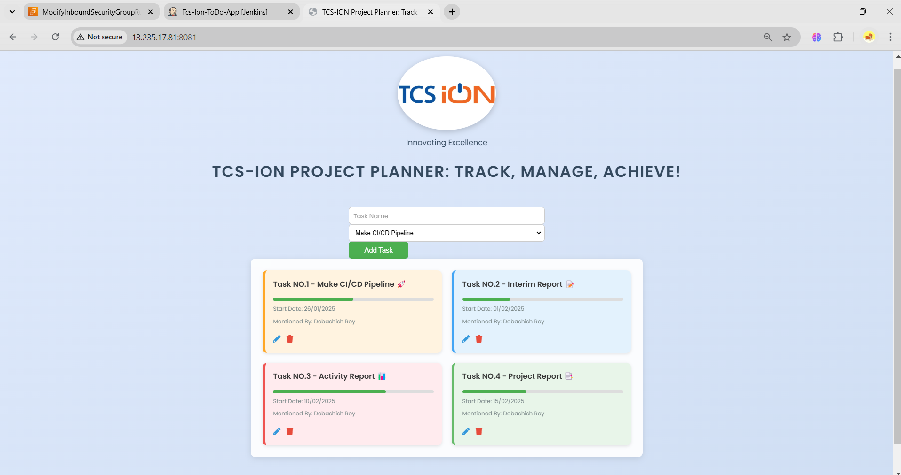

# TCS ION RIO Internship Project

## Screenshots

### To-Do Application Interface


### Jenkins CI/CD Pipeline

## Project Overview
This project is part of the **TCS ION RIO Internship**, focused on building and automating a **Spring Boot-based To-Do Application** with a complete CI/CD pipeline.

## Features
- **Spring Boot Backend**
- **REST API for To-Do Management**
- **CI/CD Pipeline with Jenkins & GitHub Actions**
- **Dockerized Deployment**
- **Kubernetes Integration**
- **Monitoring with Prometheus & Grafana**

## Tech Stack
- **Backend:** Spring Boot, Java
- **Database:** MySQL / PostgreSQL
- **CI/CD:** Jenkins, GitHub Actions
- **Containerization:** Docker, Kubernetes
- **Monitoring:** Prometheus, Grafana
- **Logging:** Splunk
- **Version Control:** Git, GitHub

## Installation & Setup
### Prerequisites
Ensure you have the following installed:
- Java 17+
- Maven
- Docker & Docker Compose
- Kubernetes (Minikube, EKS, or any cluster)
- Jenkins (if using self-hosted CI/CD)

### Steps to Run Locally
1. Clone the repository:
   ```sh
   git clone https://github.com/YashDevops20/TCS-ION-RIO-INTERNSHIP-PROJECT.git
   cd TCS-ION-RIO-INTERNSHIP-PROJECT
   ```
2. Build the project:
   ```sh
   mvn clean install
   ```
3. Run the application:
   ```sh
   mvn spring-boot:run
   ```
4. Access the API at `http://localhost:8080`

## CI/CD Pipeline
- **Build Automation:** Jenkins Pipeline / GitHub Actions
- **Docker Build & Push:** Docker Hub / JFrog Artifactory
- **Kubernetes Deployment:** Helm charts for cluster setup

## Monitoring & Logging
- **Metrics:** Prometheus scrapes application metrics
- **Visualization:** Grafana dashboards
- **Logging:** Centralized logging via Splunk

## Contribution
Feel free to fork the repository, raise issues, and contribute via pull requests.

